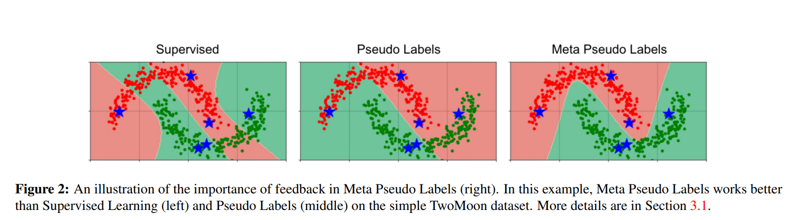

[CVPR] [2021] [self-training]

- 論文連結：[[arXiv](https://arxiv.org/abs/2003.10580)]
- 程式碼連結：[[Papers With Code](https://paperswithcode.com/paper/meta-pseudo-labels)] [[Google Research](https://github.com/google-research/google-research/tree/master/meta_pseudo_labels)] [[MPL-pytorch](https://github.com/kekmodel/MPL-pytorch)]



這篇論文主要貢獻：
1. 提出一個新的 Pseudo Labeling 方法，可以學習 teacher network 的模型參數。
2. 透過大量的實驗來驗證此方法的有效性，並且在 ImageNet 上面有 $90.2%$ top-1 準確率，達到 SOTA。

方法的重點：
1. 借用 [40, 15] 的 meta-learning 方法，透過 one-step gradient 進行更新參數，來近似原本 multi-step 的結果。
2. 利用 1. 的作法，讓原本 Pseudo Labels 的 teacher-student 的架構中的 teacher network 模型參數可以訓練。


**References**
- [40]: Hanxiao Liu, Karen Simonyan, and Yiming Yang. Darts: Differentiable architecture search. In *International Conference on Learning Representations*, 2019. 2, 8
- [15]: Chelsea Finn, Pieter Abbeel, and Sergey Levine. Model-agnostic meta-learning for fast adaptation of deep networks. In *International Conference on Machine Learning*, 2017. 2


## Pseudo Labels

Pseudo Labels 是一種 self-training 方法，其作法如下：
1. 準備兩個模型，一個是 teacher network，另一個是 student network。
2. 使用有 labels 的 dataset、或是使用更大的架構，以監督式學習 (supervised learning) 進行訓練 teacher network。
3. 使用沒有 labels 的 dataset、或是使用更小的架構，以半監督式學習 (semi-supervised learning) 進行訓練 student network。詳細作法如下：
   1. 將 teacher network 的參數固定，把 unlabeled data 傳入 teacher network 以後將會輸出 teacher network 的預測結果。
   2. 將 teacher network 的預測結果視為 labels (稱為 pseudo labels)，以監督式學習進行訓練 student network。

這樣做的好處是：可以在任意大的 unlabeled dataset 進行訓練。在機器學習任務中，labels 是非常貴的資源，相較之下 unlabeled data 的蒐集更容易些。目前研究有許多 unlabeled dataset 比 labeled dataset 資料量相差超過一個數量級。

### Drawback

由 teacher network 產生的 pseudo，以直覺來看當然不是 100% 準確的。這會造成：
- 如果 pseudo labels 不準確，那 student network 就會用不準確的 labels 進行訓練，想當然的結果就會不好。想想這句話："Garbage in, garbage out." 
- Student network 的結果無法明顯的好過 teacher network。

這件事情在先前的研究中被發現，稱為 confirmation bias (確認偏誤)。


**Confirmation bias**\
Network predictions are, of course, sometimes incorrect. This situation is
reinforced when incorrect predictions are used as labels for unlabeled samples, as
it is the case in pseudo-labeling.

Overfitting to incorrect pseudo-labels predicted by the network is known as
confirmation bias. It is natural to think that reducing the confidence of the
network on its predictions might alleviate this problem and improve
generalization.

- [2]: ARAZO, Eric, et al. Pseudo-labeling and confirmation bias in deep semi-supervised learning. In: *2020 International Joint Conference on Neural Networks
(IJCNN)*. IEEE, 2020. p. 1-8. 


## Meta Pseudo Labels

這篇方法的主軸在於**如何使 teacher network 可以訓練**。

### Overview

### Notations

- $T, S$: the teacher network and the student network respectively
- $\theta_T, \theta_S$: their corresponding parameters
- $(x_l, y_l)$: a batch of images and their corresponding labels
- $x_u$: a batch of unlabeled images
- $T(x_u; \theta_T)$: the *soft* predictions of the teacher network on the batch $x_u$ of unlabeled images
- $S(x_l; \theta_S), S(x_u; \theta_S)$: (likewise for student)
- $\text{CE}(q, p)$: the cross-entropy loss between two distributions $q$ and $p$
    - if $q$ is a label then it is understood as a one-hot distribution
    - if $q$ and $p$ have multiple instances in them 
    then $\text{CE}(q, p)$ is understood as the average of all instances in the batch.
      - e.g. $\text{CE}(y_l, S(x_l; \theta_S))$ is the canonical cross-entropy loss in supervised learning.

### Pseudo Labels

Pseudo Labels (PL) 利用 cross-entropy loss 在 unlabeled dataset 上面訓練 student network，可以被描述如下式：

$$
\theta_{S}^{\mathrm{PL}} =
\underset{\theta_{S}}{\text{argmin }}
\underbrace{
    \mathbb{E}_{x_{u}}\left[\operatorname{CE}
    \left(T\left(x_{u} ; \theta_{T}\right), S\left(x_{u}; \theta_{S}\right)\right)\right]
}_{
    :=\mathcal{L}_{u}\left(\theta_{T}, \theta_{S}\right)
}
$$
其中：
- Pseudo target $T(x_u; θ_T)$ 是由 pre-trained teacher network 產生，其參數 $θ$ 是固定的。

(數學式解讀：在 unlabeled dataset 中進行訓練時，其 CE 的期望值定義為一個以 teacher 和 student network 的參數作為輸入的函數。)

### Meta Pseudo Labels

概念上來說，給定一個好的 teacher network，Pseudo Labels 希望可以在 labeled data 上面將 student network 訓練到很小的 loss，取得其參數 $\theta_S^{\text{PL}}$：

$$
\mathbb{E}_ {x_{l}, y_{l}}\left[\mathrm{CE}\left(y_{l}, S\left(x_{l}; \theta_{S}^{\mathrm{PL}}\right)\right)\right]:=\mathcal{L}_{l}\left(\theta_{S}^{\mathrm{PL}}\right)
$$

(數學式解讀：在 labeled dataset 中進行訓練，其 CE 的期望值定義為一個以 student network 的參數作為輸入的函數。)

其中，student loss 在 labeled data 可以被描述為：$\mathcal{L}_ {l}\left(\theta_{S}^{\mathrm{PL}}\left(\theta_{T}\right)\right)$，這可以被看作是一個輸入為 $\theta_T$ 的函數.

所以，我們可以進一步的根據 $\theta_T$ 來最佳化 $\mathcal{L}_l$:

$$\begin{aligned}
\min_ {\theta_{T}} & \mathcal{L}_ {l}\left(\theta_ {S}^{\mathrm{PL}}\left(\theta_ {T}\right)\right) \newline
\text { where } & \theta_ {S}^{\mathrm{PL}}\left(\theta_ {T}\right)=\underset{\theta_ {S}}{\operatorname{argmin}} \mathcal{L}_ {u}\left(\theta_ {T}, \theta_ {S}\right) .
\end{aligned}$$

(數學式解讀：在 labeled dataset 中調整 teacher network 的參數來最小化 loss，其 student network 的參數是在 unlabeled dataset 中進行訓練。)

直覺上來說，我們可以根據 student network 在 labeled data 的結果來進行最佳化 teacher network 的參數。但是，student network 的參數在 teacher network 的相依性非常複雜，計算梯度 $\nabla_{\theta_T} \theta_S^{\text{PL}}(\theta_T)$ 時需要對整個 student network 的訓練過程進行展開。也就是說，如果 student network 訓練過程需要 100 個 epochs，這整個過程的計算圖都要保留下來，才有辦法計算 teacher network 的參數。

### Practical Approximation

為了讓上面的計算式可行，本篇論文使用了 [40, 15] 關於 meta-learning 的論文，以 one-step gradient update 來近似本來應該要用 multi-step 更新的參數：

$$\theta_{S}^{\mathrm{PL}}\left(\theta_{T}\right) \approx \theta_{S}-\eta_{S} \cdot \nabla_{\theta_{S}} \mathcal{L}_{u}\left(\theta_{T}, \theta_{S}\right)$$

其中：
- $\eta$: the learning rate

在 Meta Pseudo Labels 中，teacher network 的目標函數如下：

$$
\min_ {\theta_ {T}} \mathcal{L}_ {l}\left(\theta_ {S}^{\mathrm{PL}}\left(\theta_ {T}\right)\right) \newline \approx \mathcal{L}_ {l}\left(\theta_ {S}-\eta_ {S} \cdot \nabla_ {\theta_ {S}} \mathcal{L}_ {u}\left(\theta_ {T}, \theta_ {S}\right)\right)
$$

比較原式：

$$
\min_ {\theta_{T}} \mathcal{L}_ {l}\left(\theta_ {S}^{\mathrm{PL}}\left(\theta_ {T}\right)\right) =
\mathcal{L}_ {l}\left( \underset{\theta_ {S}}{\operatorname{argmin}} \mathcal{L}_ {u}\left(\theta_ {T}, \theta_ {S}\right) \right)
$$

Student network 參數更新後可以在 teacher network 中被重複利用：
- Student: 取出一個 batch 的 unlabeled data，然後傳入 student 和 teacher network 取得預測結果。將 teacher network 的預測結果作為 pseudo labels 來計算 loss，並更新 student network 的參數：
    $$
    θ'_ S = θ_ S − \eta_ S ∇_ {θ_ S} \mathcal{L}_ u(θ_ T , θ_ S)
    $$
- Teacher: 取出一個 batch 的 labeled data，然後傳入 student 和 teacher network 取得預測結果。將 student network 的預測結果與 labels (ground-truth) 來計算 loss 並更新 teacher network 的參數：
    $$
    \theta_{T}^{\prime} = \theta_{T}-\eta_{T}\nabla_{\theta_{T}} \mathcal{L}_{l}(\underbrace{\theta_{S}-\nabla_{\theta_{S}} \mathcal{L}_{u}\left(\theta_{T}, \theta_{S}\right)} _{= \theta_{S}^{\prime}}) = \theta_{T}-\eta_{T}\nabla_{\theta_{T}} \mathcal{L}_{l}(\theta_{S}^{\prime}).
    $$

接下來還有兩個選擇：teacher network 要輸出 soft pseudo labels 還是 hard pseudo labels：
- Soft pseudo labels: 可行，目標函數是可微分的。
- Hard pseudo labels: 計算圖較小，這在大型 dataset 的實驗中是必要的。

此外，作者也發現選用 soft 或是 hard 沒有顯著差異。不過在使用 hard pseudo labels 時，需要使用小改過的 REINFORCE 來求得上面的近似梯度 (在附錄 A 中詳細推導)。

### Teacher's Auxiliary Loss

另外，如果使用輔助 loss 訓練的結果會更好。所以，作者用監督式和半監督式的目標函數進行 teacher network 的訓練：
1. 監督式訓練：在 labeled dataset 上面訓練 teacher network。
2. 半監督式訓練：在 unlabeled dataset 上面利用 UDA [76] 訓練 teacher network。
3. 之後，student network 只在 unlabeled dataset 上面訓練，使用 teacher network 產生的 pseudo labels。
4. 最後，student network 在 labeled dataset 上面 fine-tune。


**Reference**
- [76]: Hugo Touvron, Andrea Vedaldi, Matthijs Douze, and Hervé
Jégou. Fixing the train-test resolution discrepancy: Fixeffi-
cientnet. arXiv preprint arXiv:2003.08237, 2020. 7


## Experiments

總共做了四組實驗：
- Small Scale Experiments
- CIFAR-10-4K, SVHN-1K, and ImageNet-10% Experiments
- ResNet-50 Experiment
- Large Scale Experiment

### Small Scale Experiments

### CIFAR-10-4K, SVHN-1K, and ImageNet-10% Experiments

| Dataset      	| Image Resolution 	| #-Labeled Examples 	| #-Unlabeled Examples 	| #-Test Set 	|
| :--------------:	|:------------------:	|--------------------:	|----------------------:	|------------:	|
| **CIFAR-10-4K**  	| 32x32            	| 4,000              	| 41,000               	| 10,000     	|
| **SVHN-1K**      	| 32x32            	| 1,000              	| 603,000              	| 26,032     	|
| **ImageNet-10%** 	| 224x224          	| 128,000            	| 1,280,000            	| 50,000     	|

### ResNet-50 Experiment

### Large Scale Experiment

