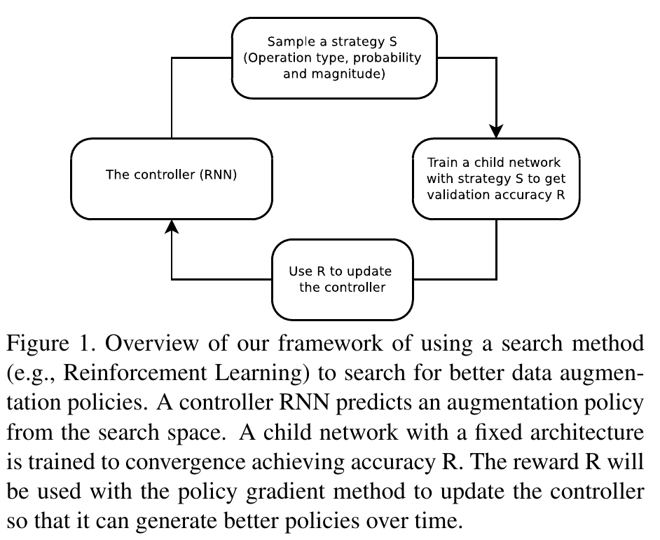
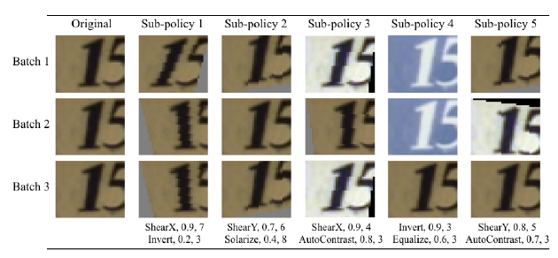

---
tags:
    - 2019
    - CVPR
    - Data Augmentation
---
# AutoAugment: Learning Augmentation Strategies from Data

`2019` `CVPR` `Data Augmentation`

論文連結：[https://arxiv.org/abs/1805.09501](https://arxiv.org/abs/1805.09501)

這篇論文的目標是自動找出 data augmentation（資料擴增）的方法。總結來說，這篇論文的方法達成幾項成就：

1. AutoAugment-direct: 它可以用在任何你想用的 dataset 上面，找出最好的 augmentation policy。
2. AutoAugment-transfer: 訓練好的 policy 可以轉移到新的 dataset 上面。

這篇論文使用的 dataset:
- CIFAR-10
- CIFAR-100
- SVHN
- reduced SVHN
- ImageNet

> Firstly, for direct application, our method achieves state-of-the-art accuracy on datasets such as CIFAR-10, reduced CIFAR-10, CIFAR-100, SVHN, reduced SVHN, and ImageNet (without additional data). On CIFAR-10, we achieve an error rate of 1.5%, which is 0.6% better than the previous state-of-the-art [48]. On SVHN, we improve the state-of-the-art error rate from 1.3% [12] to 1.0%. On reduced datasets, our method achieves performance comparable to semi-supervised methods without using any unlabeled data. On ImageNet, we achieve a Top-1 accuracy of 83.5% which is 0.4% better than the previous record of 83.1%. Secondly, if direct application is too expensive, transferring an augmentation policy can be a good alternative.

> For transferring an augmentation policy, we show that policies found on one task can generalize well across different models and datasets. For example, the policy found on ImageNet leads to significant improvements on a variety of FGVC datasets. Even on datasets for which fine-tuning weights pre-trained on ImageNet does not help significantly [26], e.g. Stanford Cars [27] and FGVC Aircraft [38], training with the ImageNet policy reduces test set error by 1.2% and 1.8%, respectively. This result suggests that transferring data augmentation policies offers an alternative method for standard weight transfer learning. A summary of our results is shown in Table 1.

## AutoAugment: Searching for best Augmentation policies Directly on the Dataset of Interest

尋找最好的 augmentation policy（擴增策略）的問題定義為 discrete search problem（離散搜尋問題）。方法包含兩個部份：
1. 搜尋演算法（在本篇實作上是 controller RNN）
2. 搜尋空間

整個架構的流程如 Figure 1。

步驟大致如下：
1. Controller RNN 從 search space **sample** 一個 policy $S$。
2. 用 $S$ 來訓練 child network。訓練到收斂以後，得到一個驗證集準確率（validation accuracy）$R$。
3. 準確率 $R$ 當作 reward。但是 $R$ 是不可微分的，所以用 policy gradient 來更新 controller 的參數。

### Search space details

每個搜尋空間，一個 policy 包含 5 sub-policies，每個 sub-policy 包含兩個 image operations，每個 operation 有兩個 hyper-parameters:
1. 使用這個 operation 的機率
2. 使用這個 operation 的量值（magnitude）

（實際上應該有第三個 hyper-parameter: operation type）

如 Figure 2: Sub-policy 1 有兩個 operations: ShearX 和 Invert，旁邊有他要作用的機率和量值。

### Search algorithm details

Proximal Policy Optimization algorithm 

每一個 step，controller 進行預測（Softmax 的輸出結果）。預測結果傳入下一個 step 作為 embedding。

### The training of controller RNN

Controller RNN 利用 child model 產生的 validation accuracy 作為 reward 來更新參數。訓練 child model 的時候，會用 5 個 sub-policies，每個 mini-batch 會使用其中一個 sub-policy 來進行資料擴增。

### Architecture of controller RNN and training hyper-parameters

訓練方式和 hyper-parameters（超參數）的設定參考了 [72]。

Controller RNN 用一層 100 hidden units 的 LSTM，還有兩個 convolutional cells 輸出 $2 \times 5$B softmax 作為預測（B 通常是 5）。每個 10B 預測結果跟機率有關係。Child model 的 joint probability 是所有這些 10B 的 softmaxes 輸出結果的乘積，用來計算 controller RNN 的 gradient。

實作細節

> Similar to [72], we employ Proximal Policy Optimization (PPO) [53] with learning rate 0.00035. To encourage exploration we also use an entropy penalty with a weight of 0.00001. In our implementation, the baseline function is an exponential moving average of previous rewards with a weight of 0.95. The weights of the controller are initialized uniformly between -0.1 and 0.1. We choose to train the controller using PPO out of convenience, although prior work had shown that other methods (e.g. augmented random search and evolutionary strategies) can perform as well or even slightly better [30].
> At the end of the search, we concatenate the sub-policies from the best 5 policies into a single policy (with 25 sub-policies). This final policy with 25 sub-policies is used to train the models for each dataset.

## References

- [30]: M. Kumar, G. E. Dahl, V. Vasudevan, and M. Norouzi. Parallel architecture and hyperparameter search via successive halving and classification. arXiv preprint arXiv:1805.10255, 2018. 4
- [53]: J. Schulman, F. Wolski, P. Dhariwal, A. Radford, and O. Klimov. Proximal policy optimization algorithms. arXiv preprint arXiv:1707.06347, 2017. 3, 4
- [72]: B. Zoph, V. Vasudevan, J. Shlens, and Q. V. Le. Learning transferable architectures for scalable image recognition. In Proceedings of IEEE Conference on Computer Vision and Pattern Recognition, 2017. 1, 2, 3, 4

## 感想

這篇論文 苦力 > insight

不過引用數算是很高的（一年 > 500）。
