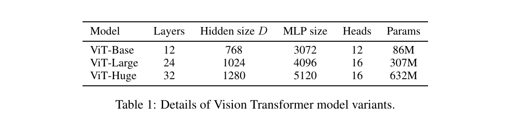

---
tags:
   - 2020
   - ICLR
   - Image Recognition
   - Transformer
   - Vision Transformer
   - ViT
---

# An Image is Worth 16x16 Words: Transformer for Image Recognition at Scale

<Badge text='2020' type='year' vertical='middle'/>
<Badge text='ICLR' type='published-on' vertical='middle'/>
<Badge text='Image Recognition' type='info' vertical='middle'/>
<Badge text='Transformer' type='info' vertical='middle'/>
<Badge text='Vision Transformer' type='info' vertical='middle'/>
<Badge text='ViT' type='info' vertical='middle'/>

作者 (Google Research, Brain Team)
- Alexey Dosovitskiy
- Lucas Beyer
- Alexander Kolesnikov
- Dirk Weissenborn
- Xiaohua Zhai
- Thomas Unterthiner
- Mostafa Dehghani
- Matthias Minderer
- Georg Heigold
- Sylvain Gelly
- Jakob Uszkoreit
- Neil Houlsby

[[TOC]]

## Introduction

目前 ResNet-like 模型主宰整個影像辨識領域。受到 Transformer 的啟發，這篇論文嘗試使用 Transformer 解決影像辨識的問題。作法是將影像拆成許多個 patches，把這些 patches 當作 NLP 模型的序列作為輸入，以監督式學習的方式訓練分類器。

在訓練中型 dataset (e.g. ImageNet) 這個模型的準確率較差一些，原因是缺乏 **inductive biases** (歸納偏置 [wiki]) ：翻譯任務的 equivariance (等變性) 與 locality (局部性)，在資料量少的情況下 generalize (泛化) 。
> Transformers lack some of the inductive biases inherent to CNNs, such as translation equivariance and locality, and therefore do not generalize well when trained on insufficient amounts of data.

[wiki]: https://en.wikipedia.org/wiki/Inductive_bias

但是如果模型訓練在大型 dataset (數量在 14M-300M) 就會 inductive bias。
> We find that large scale training trumps inductive bias.

## Related Work

### Transformer

- Vaswani et al. (2017): 發明 Transformer，在 NLP tasks 達到 SOTA。
- BERT (Devlin et al., 2019): denoising self-supervised pretrained on large corpora (在大型語料庫進行預訓練), 
- GPT (Radford et al., 2018; 2019; Brown et al., 2020): uses language modeling as its pre-training task

Naive 的 self-attention 應用：讓一個 pixel 和其他所有的 pixels 一一計算 attention。這樣做的問題是在真實影像上的計算複雜度過高。所以其他人嘗試近似的方法：
- Parmar et al. (2018): 只在相鄰的區域計算 self-attention 而非全域。
- Such local multi-head dot-product self attention blocks can completely replace convolutions (Ramachandran et al., 2019; Cordonnier et al., 2020; Zhao et al., 2020). 
- Sparse Transformers (Child et al., 2019): employ scalable approximations to global self-attention in order to be applicable to images
- (Weissenborn et al., 2019): 在可變長度的區塊計算 attention
- (Ho et al., 2019; Wang et al., 2020a): 在單一軸上計算 attention

這些方法結果很好，但需要複雜的設計才能在硬體加速器 (hardware accelerators) 有效率的計算。
> Many of these specialized attention architectures demonstrate promising results on computer vision tasks, but require complex engineering to be implemented efficiently on hardware accelerators.

### CNN + Transformer

- (Bello et al., 2019): augmenting feature maps for image classification
- by further processing the output of a CNN using self-attention, e.g. 
  - for object detection (Hu et al., 2018; Carion et al., 2020)
  - video processing (Wang et al., 2018; Sun et al., 2019)
  - image classification (Wu et al., 2020)
  - unsupervised object discovery (Locatello et al., 2020)
  - unified text-vision tasks (Chen et al., 2020c; Lu et al., 2019; Li et al., 2019)

### 跟本篇相近的方法

- iGPT (Chen et al., 2020a): 在減少影像解析度和色彩空間以後使用 Transformer，以 unsupervised learning 方式訓練生成模型
    > and the resulting representation can then be fine-tuned or probed linearly for classification performance, achieving a maximal accuracy of 72% on ImageNet.

### 增加訓練資料量可以在標準的 Benchmark 達到 SOTA

> Our work adds to the increasing collection of papers that explore image recognition at larger scales than the standard ImageNet dataset. The use of additional data sources allows to achieve state-of-the-art results on standard benchmarks (Mahajan et al., 2018; Touvron et al., 2019; Xie et al., 2020). Moreover, Sun et al. (2017) study how CNN performance scales with dataset size, and Kolesnikov et al. (2020); Djolonga et al. (2020) perform an empirical exploration of CNN transfer learning from large scale datasets such as ImageNet-21k and JFT-300M. We focus on these two latter datasets as well, but train Transformers instead of ResNet-based models used in prior works.

## Method

在模型設計上，盡可能的和原本的 Transformer 長得一樣。這樣做的好處是 Transformer 的改進模型也可以透過簡單的調整來應用這篇的方法。

> An advantage of this intentionally simple setup is that scalable NLP Transformer architectures – and their efficient implementations – can be used almost out of the box.

### Vision Transformer (ViT)

標準的 Transformer 接收 1D 的序列 token embeddings 資料作為輸入。為了處理 2D 的影像，利用 reshape $x \in R^{H \times W \times C}$ into a sequence of flattened 2D patches $\mathbf{x}_{p} \in R^{N \times (P^{2} \cdot C)}$。
- $(H, W)$: 原本影像的解析度
- $C$: channels 數量
- $(P, P)$: 每個 patch 的解析度
- $N = HW/P^2$: patches 的數量
- $D$: constant latent vector size

$D$ 是所有 layers 輸出的維度，所以輸入的 patches 利用一個 trainable linear projection 映射到這個維度，把這個 projection 輸出結果當作 patch embedding。

類似 BERT 的 `[class]` token，這裡前置一個可學習的類別 embedding 在 patches ($z_0^0 = \mathbf{x}_{class}$)。Transformer encoder ($\mathbf{z}_L^0$) 的狀態當作 image representation $\mathbf{y}$。分類器 (classification head) 的實作方式，分別在
1. pre-training time (預訓練階段): 一層 hidden layer 的 MLP
2. fine-tuning time (微調階段): 一層 linear layer

> Similar to BERT's `[class]` token, we prepend a learnable embedding to the sequence of embedded patches ($z_0^0 = \mathbf{x}_{class}$), whose state at the output of the Transformer encoder ($\mathbf{z}_L^0$) serves as the image representation $\mathbf{y}$ (Eq. 4). Both during pre-training and fine-tuning, a classification head is attached to ($\mathbf{z}_L^0$) . The classification head is implemented by a MLP with one hidden layer at pre-training time and by a single linear layer at fine-tuning time.

#### Position Embedding

根據實驗結果 (Appendix D.3) 使用 2D-aware position embedding 的效果並不顯著，因此使用標準的 1D position embeddings。Embedding 最後輸入到 encoder。

> Position embeddings are added to the patch embeddings to retain positional information. We use standard learnable 1D position embeddings, since we have not observed significant performance gains from using more advanced 2D-aware position embeddings (Appendix D.3). The resulting sequence of embedding vectors serves as input to the encoder.

#### Transformer Encoder

Encoder 包含：
- Multiheaded self-attention (MSA)
- MLP blocks (Eq. 2, 3)
  - 兩層
  - GELU
- Layernorm (LN) 在每個 block 之前
- Residual connections 在每個 block 之後

數學式的解讀：
- $\mathbf{x}_p^i$: 輸入的第 i 個 patch
- $\mathbf{x}_{class}$: 類別的 embedding
  - 更細節的：如何做出 embedding? 使用一個矩陣 (類別數)x(embedding size)
- $\mathbf{z}_j$: 第 j 層的輸入

#### Hybrid Architecture

可以用 CNN 的 feature maps 替代原本的 raw image patches，稱為 hybrid model。

Patches 可能大小是 1x1，因此輸入的序列可以透過簡單的攤平 (flatten) feature maps 的維度再投影到 Transformer 的維度。

> As a special case, the patches can have spatial size 1x1, which means that the input sequence is obtained by simply flattening the spatial dimensions of the feature map and projecting to the Transformer dimension. The classification input embedding and position embeddings are added as described above.

### Fine-Tuning and Higher Resolution

訓練策略：在大型 dataset pre-train ViT，然後在小型 downstream tasks 進行 fine-tune。

Fine-tune 作法：移除 prediction head，然後加入以 0 初始化的 $D \times K$ 的 feedforward layer，其中 $K$ 是 downstream 類別的數量。
>  It is often beneficial to fine-tune at higher resolution than pre-training (Touvron et al., 2019; Kolesnikov et al., 2020). When feeding images of higher resolution, we keep the patch size the same, which results in a larger effective sequence length.

Vision Transformer 可以處理任意的序列長度，但是 pre-trained position embeddings 可能就會失去意義。所以這裡根據原本影像的解析度，使用 2D interpolation 計算 pre-trained position embeddings。
> Note that this resolution adjustment and patch extraction are the only points at which an inductive bias about the 2D structure of the images is manually injected into the Vision Transformer.

## Experiments

### Setup

#### Datasets

- ILSVRC-2012 ImageNet: 1k classes and 1.3M images
- ImageNet-21k (Deng et al., 2009): 21k classes and 14M images
- JFT (Sun et al., 2017): 18k classes and 303M high-resolution images

> We de-duplicate the pre-training datasets w.r.t. the test sets of the downstream tasks following Kolesnikov et al. (2020). We transfer the models trained on these dataset to several benchmark tasks: ImageNet on the original validation labels and the cleaned-up ReaL labels (Beyer et al., 2020), CIFAR-10/100 (Krizhevsky, 2009), Oxford-IIIT Pets (Parkhi et al., 2012), and Oxford Flowers-102 (Nilsback & Zisserman, 2008). For these datasets, pre-processing follows Kolesnikov et al. (2020).

- 19-task VTAB classification suite (Zhai et al., 2019b): low-data transfer to diverse tasks, using 1,000 training examples per task. The tasks are divided into
three groups:
  - *Natural* – tasks like the above, Pets, CIFAR, etc.
  - *Specialized* – medical and satellite imagery
  - *Structured* – tasks that require geometric understanding like localization

#### Model Variants

#### Training & Fine-Tuning

#### Metrics

### Comparison to State of the Art

### Pre-training Data Requirements

### Scaling Study

### Inspecting Vision Transformer

### Self-Supervision

## Conclusion

## Appendix
