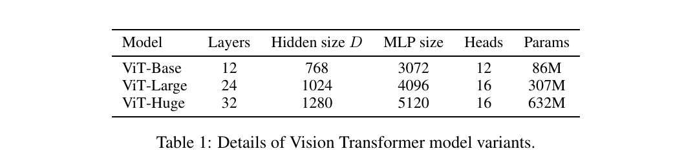
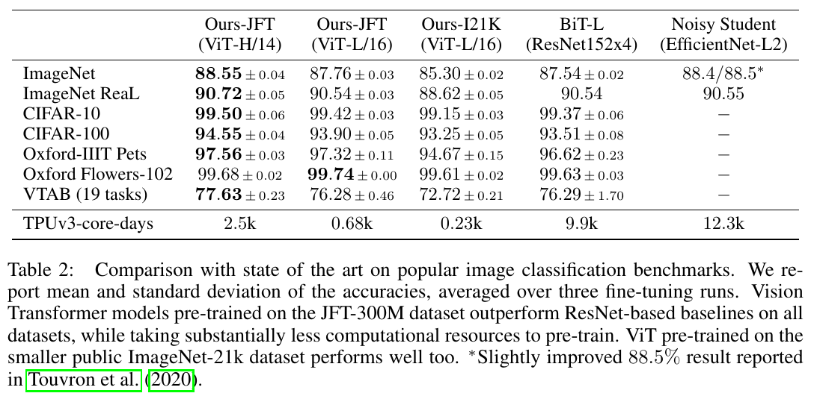
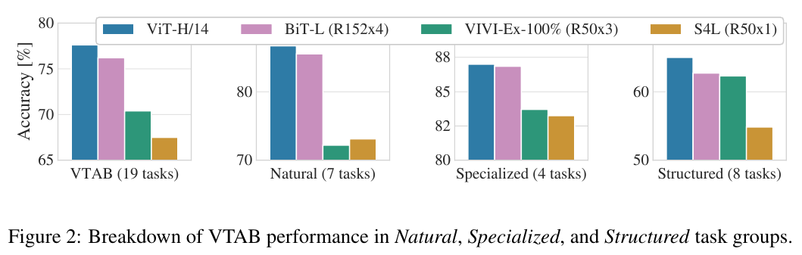
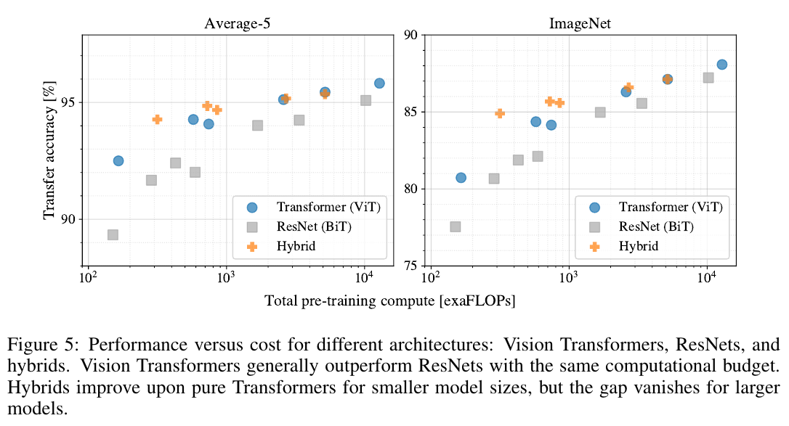
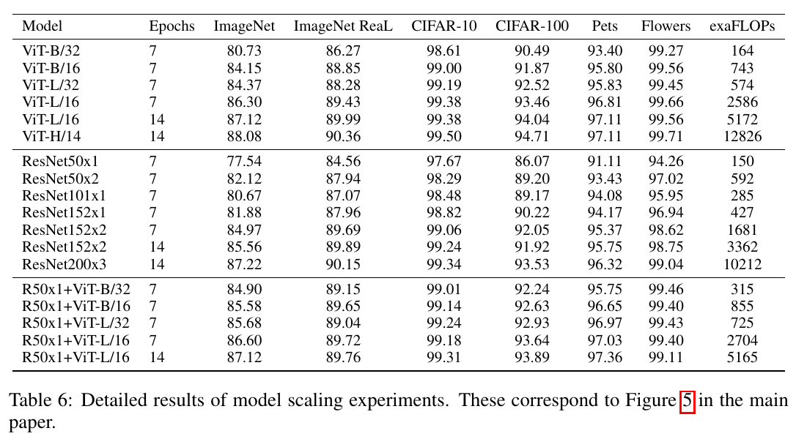
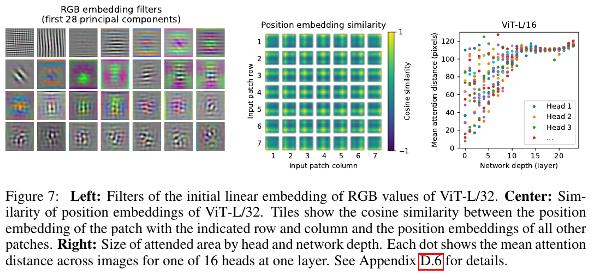
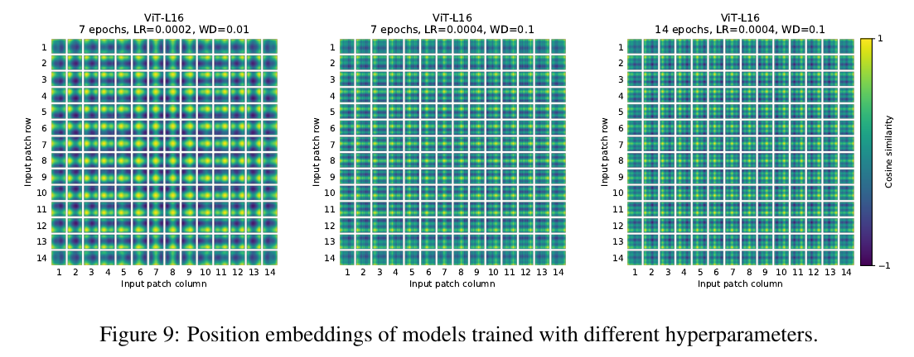
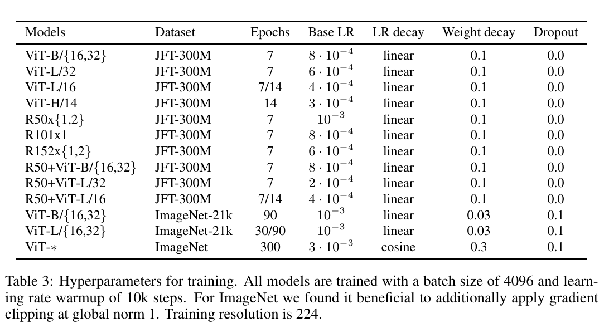
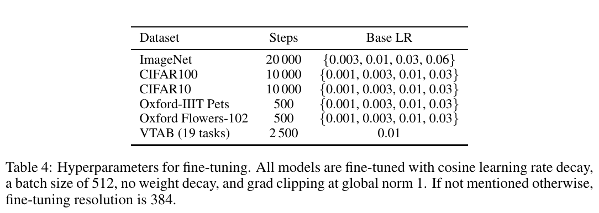

---
tags:
   - 2021
   - ICLR
   - Image Recognition
   - Transformer
   - Vision Transformer
   - ViT
---

# An Image is Worth 16x16 Words: Transformer for Image Recognition at Scale

<Badge text='2021' type='year' vertical='middle'/>
<Badge text='ICLR' type='published-on' vertical='middle'/>
<Badge text='Image Recognition' type='info' vertical='middle'/>
<Badge text='Transformer' type='info' vertical='middle'/>
<Badge text='Vision Transformer' type='info' vertical='middle'/>
<Badge text='ViT' type='info' vertical='middle'/>

作者 (Google Research, Brain Team)
- Alexey Dosovitskiy
- Lucas Beyer
- Alexander Kolesnikov
- Dirk Weissenborn
- Xiaohua Zhai
- Thomas Unterthiner
- Mostafa Dehghani
- Matthias Minderer
- Georg Heigold
- Sylvain Gelly
- Jakob Uszkoreit
- Neil Houlsby

## Table of Content

[[TOC]]

## Introduction

目前 ResNet-like 模型主宰整個影像辨識領域。受到 Transformer 的啟發，這篇論文嘗試使用 Transformer 解決影像辨識的問題。作法是將影像拆成許多個 patches，把這些 patches 當作 NLP 模型的序列作為輸入，以監督式學習的方式訓練分類器。

在訓練中型 dataset (e.g. ImageNet) 這個模型的準確率較差一些，原因是缺乏 **inductive biases** (歸納偏置 [wiki]) ：翻譯任務的 equivariance (等變性) 與 locality (局部性)，在資料量少的情況下 generalize (泛化) 。
> Transformers lack some of the inductive biases inherent to CNNs, such as translation equivariance and locality, and therefore do not generalize well when trained on insufficient amounts of data.

[wiki]: https://en.wikipedia.org/wiki/Inductive_bias

但是如果模型訓練在大型 dataset (數量在 14M-300M) 就會 inductive bias。
> We find that large scale training trumps inductive bias.

## Related Work

### Transformer

- Vaswani et al. (2017): 發明 Transformer，在 NLP tasks 達到 SOTA。
- BERT (Devlin et al., 2019): denoising self-supervised pretrained on large corpora (在大型語料庫進行預訓練), 
- GPT (Radford et al., 2018; 2019; Brown et al., 2020): uses language modeling as its pre-training task

Naive 的 self-attention 應用：讓一個 pixel 和其他所有的 pixels 一一計算 attention。這樣做的問題是在真實影像上的計算複雜度過高。所以其他人嘗試近似的方法：
- Parmar et al. (2018): 只在相鄰的區域計算 self-attention 而非全域。
- Such local multi-head dot-product self attention blocks can completely replace convolutions (Ramachandran et al., 2019; Cordonnier et al., 2020; Zhao et al., 2020). 
- Sparse Transformers (Child et al., 2019): employ scalable approximations to global self-attention in order to be applicable to images
- (Weissenborn et al., 2019): 在可變長度的區塊計算 attention
- (Ho et al., 2019; Wang et al., 2020a): 在單一軸上計算 attention

這些方法結果很好，但需要複雜的設計才能在硬體加速器 (hardware accelerators) 有效率的計算。
> Many of these specialized attention architectures demonstrate promising results on computer vision tasks, but require complex engineering to be implemented efficiently on hardware accelerators.

### CNN + Transformer

- (Bello et al., 2019): augmenting feature maps for image classification
- by further processing the output of a CNN using self-attention, e.g. 
  - for object detection (Hu et al., 2018; Carion et al., 2020)
  - video processing (Wang et al., 2018; Sun et al., 2019)
  - image classification (Wu et al., 2020)
  - unsupervised object discovery (Locatello et al., 2020)
  - unified text-vision tasks (Chen et al., 2020c; Lu et al., 2019; Li et al., 2019)

### 跟本篇相近的方法

- iGPT (Chen et al., 2020a): 在減少影像解析度和色彩空間以後使用 Transformer，以 unsupervised learning 方式訓練生成模型
    > and the resulting representation can then be fine-tuned or probed linearly for classification performance, achieving a maximal accuracy of 72% on ImageNet.

### 增加訓練資料量可以在標準的 Benchmark 達到 SOTA

> Our work adds to the increasing collection of papers that explore image recognition at larger scales than the standard ImageNet dataset. The use of additional data sources allows to achieve state-of-the-art results on standard benchmarks (Mahajan et al., 2018; Touvron et al., 2019; Xie et al., 2020). Moreover, Sun et al. (2017) study how CNN performance scales with dataset size, and Kolesnikov et al. (2020); Djolonga et al. (2020) perform an empirical exploration of CNN transfer learning from large scale datasets such as ImageNet-21k and JFT-300M. We focus on these two latter datasets as well, but train Transformers instead of ResNet-based models used in prior works.

## Method

在模型設計上，盡可能的和原本的 Transformer 長得一樣。這樣做的好處是 Transformer 的改進模型也可以透過簡單的調整來應用這篇的方法。

> An advantage of this intentionally simple setup is that scalable NLP Transformer architectures – and their efficient implementations – can be used almost out of the box.

### Vision Transformer (ViT)

標準的 Transformer 接收 1D 的序列 token embeddings 資料作為輸入。為了處理 2D 的影像，利用 reshape $x \in R^{H \times W \times C}$ into a sequence of flattened 2D patches $\mathbf{x}_{p} \in R^{N \times (P^{2} \cdot C)}$。
- $(H, W)$: 原本影像的解析度
- $C$: channels 數量
- $(P, P)$: 每個 patch 的解析度
- $N = HW/P^2$: patches 的數量
- $D$: constant latent vector size

$D$ 是所有 layers 輸出的維度，所以輸入的 patches 利用一個 trainable linear projection 映射到這個維度，把這個 projection 輸出結果當作 patch embedding。

類似 BERT 的 `[class]` token，這裡前置一個可學習的類別 embedding 在 patches ($z_0^0 = \mathbf{x}_{class}$)。Transformer encoder ($\mathbf{z}_L^0$) 的狀態當作 image representation $\mathbf{y}$。分類器 (classification head) 的實作方式，分別在
1. pre-training time (預訓練階段): 一層 hidden layer 的 MLP
2. fine-tuning time (微調階段): 一層 linear layer

> Similar to BERT's `[class]` token, we prepend a learnable embedding to the sequence of embedded patches ($z_0^0 = \mathbf{x}_{class}$), whose state at the output of the Transformer encoder ($\mathbf{z}_L^0$) serves as the image representation $\mathbf{y}$ (Eq. 4). Both during pre-training and fine-tuning, a classification head is attached to ($\mathbf{z}_L^0$) . The classification head is implemented by a MLP with one hidden layer at pre-training time and by a single linear layer at fine-tuning time.

#### Position Embedding

根據實驗結果 (Appendix D.3) 使用 2D-aware position embedding 的效果並不顯著，因此使用標準的 1D position embeddings。Embedding 最後輸入到 encoder。

> Position embeddings are added to the patch embeddings to retain positional information. We use standard learnable 1D position embeddings, since we have not observed significant performance gains from using more advanced 2D-aware position embeddings (Appendix D.3). The resulting sequence of embedding vectors serves as input to the encoder.

#### Transformer Encoder

Encoder 包含：
- Multiheaded self-attention (MSA)
- MLP blocks (Eq. 2, 3)
  - 兩層
  - GELU
- Layernorm (LN) 在每個 block 之前
- Residual connections 在每個 block 之後

$$
\begin{aligned}
\mathbf{z}_{0} &=\left[\mathbf{x}_{\text {class }} ; \mathbf{x}_{p}^{1} \mathbf{E} ; \mathbf{x}_{p}^{2} \mathbf{E} ; \cdots ; \mathbf{x}_{p}^{N} \mathbf{E}\right]+\mathbf{E}_{\text {pos }}, & \mathbf{E} \in \mathbb{R}^{\left(P^{2} \cdot C\right) \times D}, \mathbf{E}_{\text {pos }} \in \mathbb{R}^{(N+1) \times D} \\
\mathbf{z}_{\ell}^{\prime} &=\operatorname{MSA}\left(\operatorname{LN}\left(\mathbf{z}_{\ell-1}\right)\right)+\mathbf{z}_{\ell-1}, & \ell=1 \ldots L \\
\mathbf{z}_{\ell} &=\operatorname{MLP}\left(\operatorname{LN}\left(\mathbf{z}_{\ell}^{\prime}\right)\right)+\mathbf{z}_{\ell}^{\prime}, & \ell=1 \ldots L \\
\mathbf{y} &=\operatorname{LN}\left(\mathbf{z}_{L}^{0}\right) &
\end{aligned}
$$

數學式的解讀：
- $\mathbf{x}_p^i$: 輸入的第 i 個 patch
- $\mathbf{x}_{class}$: 類別的 embedding
  - 更細節的：如何做出 embedding? 使用一個矩陣 (類別數)x(embedding size)
- $\mathbf{z}_j$: 第 j 層的輸入

#### Hybrid Architecture

可以用 CNN 的 feature maps 替代原本的 raw image patches，稱為 hybrid model。

Patches 可能大小是 1x1，因此輸入的序列可以透過簡單的攤平 (flatten) feature maps 的維度再投影到 Transformer 的維度。

> As a special case, the patches can have spatial size 1x1, which means that the input sequence is obtained by simply flattening the spatial dimensions of the feature map and projecting to the Transformer dimension. The classification input embedding and position embeddings are added as described above.

### Fine-Tuning and Higher Resolution

訓練策略：在大型 dataset pre-train ViT，然後在小型 downstream tasks 進行 fine-tune。

Fine-tune 作法：移除 prediction head，然後加入以 0 初始化的 $D \times K$ 的 feedforward layer，其中 $K$ 是 downstream 類別的數量。
>  It is often beneficial to fine-tune at higher resolution than pre-training (Touvron et al., 2019; Kolesnikov et al., 2020). When feeding images of higher resolution, we keep the patch size the same, which results in a larger effective sequence length.

Vision Transformer 可以處理任意的序列長度，但是 pre-trained position embeddings 可能就會失去意義。所以這裡根據原本影像的解析度，使用 2D interpolation 計算 pre-trained position embeddings。
> Note that this resolution adjustment and patch extraction are the only points at which an inductive bias about the 2D structure of the images is manually injected into the Vision Transformer.

注意：解析度的調整和擷取 patch 的方式是這個 Vision Transformer 模型中唯一對於 2D 影像結構的**歸納偏誤（Inductive Bias）**。

::: tip Inductive Bias
In machine learning, one aims to construct algorithms that are able to learn to predict a certain target output. To achieve this, the learning algorithm is presented some training examples that demonstrate the intended relation of input and output values. Then the learner is supposed to approximate the correct output, even for examples that have not been shown during training. Without any additional assumptions, this problem cannot be solved since unseen situations might have an arbitrary output value. The kind of necessary assumptions about the nature of the target function are subsumed in the phrase inductive bias.[1][2]
  - [1]: Mitchell, T. M. (1980), *The need for biases in learning generalizations*, CBM-TR 5-110, New Brunswick, New Jersey, USA: Rutgers University, CiteSeerX 10.1.1.19.5466
  - [2]: DesJardins, M.; Gordon, D. F. (1995), *Evaluation and selection of biases in machine learning*, Machine Learning Journal, 5:–7

:::

## Experiments

### Setup

#### Datasets

- ILSVRC-2012 ImageNet: 1k classes and 1.3M images
- ImageNet-21k (Deng et al., 2009): 21k classes and 14M images
- JFT (Sun et al., 2017): 18k classes and 303M high-resolution images

> We de-duplicate the pre-training datasets w.r.t. the test sets of the downstream tasks following Kolesnikov et al. (2020). We transfer the models trained on these dataset to several benchmark tasks: ImageNet on the original validation labels and the cleaned-up ReaL labels (Beyer et al., 2020), CIFAR-10/100 (Krizhevsky, 2009), Oxford-IIIT Pets (Parkhi et al., 2012), and Oxford Flowers-102 (Nilsback & Zisserman, 2008). For these datasets, pre-processing follows Kolesnikov et al. (2020).

- 19-task VTAB classification suite (Zhai et al., 2019b): low-data transfer to diverse tasks, using 1,000 training examples per task. The tasks are divided into
three groups:
  - *Natural* – tasks like the above, Pets, CIFAR, etc.
  - *Specialized* – medical and satellite imagery
  - *Structured* – tasks that require geometric understanding like localization

參考 [Visual Task Adaptation Benchmark](https://google-research.github.io/task_adaptation/) 的說明：
> The Visual Task Adaptation Benchmark (VTAB) is a diverse and challenging suite of tasks, designed to evaluate general visual representations.
> VTAB defines a good general visual representation as one that yields good performance on unseen tasks, when trained on limited task-specific data. VTAB places no restrictions on how the representations are used, for example, frozen feature extraction, fine-tuning, and other forms of transfer to the evaluation tasks are permitted. Similarly, representations may be pre-trained on any data, VTAB permits supervised, unsupervised, or other pre-training strategy. There is one constraint: the evaluation datasets must not be used during pre-training. This constraint is designed to mitigate overfitting to the evaluation tasks.
> The benchmark consists of 19 tasks, drawn from a variety of domains, and with various semantics. All tasks are framed as classification problems to facilitate a consistent API for pre-trained models. Algorithms should not contain any task-dependent logic, for example, the same hyperparameter sweep should be used for all tasks. VTAB may also be used to evaluate techniques, other than representation learning, that improve performance across a variety of tasks: such as architectures, pre-processing functions, or optimizers.

簡單來說，這個 Dataset 的特色是用來評估：
- low-data: 少量的訓練資料
- transfer to diverse tasks: 轉移到變化大的任務上
- 1,000 training examples per task: 只有 1,000 筆訓練資料

VTAB 定義一個好的 **visual representation** 是能夠在很少量的資料上進行訓練，然後在 unseen 的任務上達到很好的性能。這個 visual representation 沒有限定怎麼使用，可以 pre-trained 在任何 dataset 上，或是其他任何策略。唯一的限制是 evaluation datasets 不可以在 pre-training 階段使用（廢話）。

#### Model Variants

根據 BERT (Devlin et al., 2019) 來設定 ViT，如 Table 1。

Base 和 Large 直接從 BERT 抄來的，然後另外再使用更大的 Huge 設定。

模型表示法: ViT-L/16 代表使用 Large 的設定，然後影像解析度設定為 $16 \times 16$ 。須特別注意 Transformer 的序列長度和 patch size 的平方成反比。

Baseline
- ResNet (BiT): 使用 ResNet 然後把 Batch Normalization 改成 Group Normalization (Wu & He, 2018)，在加上 standardized convolutions (Salimans & Kingma, 2016)。這些改動有助於轉移性 (Kolesnikov et al., 2020)。
- Hybrids: 用 $1 \times 1$ 的 patches 當作 intermediate feature maps 傳入 ViT 模型。

為了試驗不同的序列長度 (給 ViT 的 feature maps):
- 拿 ResNet50 stage 4 的輸出
- 移除 stage 4，改放相同層數在 stage 3 (保持相同層數)，然後取出輸出。這個作法可以得到 4 倍長度的序列。

#### Training & Fine-Tuning

##### Traning 

- Batch size: $4096$
- Optimizer: Adam with $\beta_1 = 0.9, \beta_2 = 0.999$
- Weight decay: $0.1$
- Linear learning rate warmup and decay

> Appendix D.1 shows that, in contrast to common practices, Adam works slightly better than SGD for ResNets in our setting

##### Fine-Tuning

- Batch size: $512$
- SGD with momentum (see Appendix B.1.1)
- 針對 ImageNet 使用更大的解析度
- also used Polyak & Juditsky (1992) averaging withfactor of 0.9999 (Ramachandran et al., 2019; Wang et al., 2020b)

#### Metrics

We report results on downstream datasets either through few-shot or fine-tuning accuracy.
- Fine-tuning accuracies capture the performance of each model after fine-tuning it on the respective dataset. (廢話)
- Few-shot accuracies are obtained by solving a **regularized linear regression problem** that maps the (frozen) representation of a subset of training images to ${−1, 1}^K$ target vectors.
  - 透過 映射固定的 representation 到 ${−1, 1}^K$ 的 target vectors 來解線性回歸問題

### Comparison to State of the Art

選手
- ViT-H/14
- ViT-L/16

比較對象
- Big Transfer (BiT) (Kolesnikov et al., 2020): which performs supervised transfer learning with large ResNets.
- Noisy Student (Xie et al., 2020): a large EfficientNet trained using semi-supervised learning on ImageNet and JFT-300M with the labels removed.
  - SOTA on ImageNet

訓練設備
> All models were trained on TPUv3 hardware, and we
report the number of TPUv3-core-days taken to pre-train each of them, that is, the number of TPUv3 cores (2 per chip) used for training multiplied by the training time in days.

從 Table 2 可以看出
- ViT-L/16 model pre-trained on JFT-300M 暴打 BiT-L，其中 ViT-L/16 訓練所需要的計算量更少
- ViT-H/14 性能更好，而且計算量還是比 SOTA 更少
- 不過其他 hyper-parameters 也會影響訓練結果，所以在 Section 4.4 有討論更詳細比較結果。

從 Figure 2 可以看出，在 VTAB tasks 上每一項 ViT-H/14 的結果都是最好的。

### Pre-training Data Requirements

討論 dataset size 的重要性
1. Pre-train ViT models on datasets of increasing size: ImageNet, ImageNet-21k, and JFT-300M (Figure 3)
  - weight decay
  - dropout
  - label smoothing
2. Train our models on random subsets of 9M, 30M, and 90M as well as the full JFT-
300M dataset

Figure 3 實驗了從各種 dataset 訓練，然後 fine-tune 到 ImageNet 的結果。從實驗結果可以看出
- 在 ImageNet 上面 pre-trained，ViT-Large 比 ViT-Base 效果還差。
- 在 ImageNet-21k 上面 pre-trained，兩個效果差不多。
- 在 JFT-300M 上面 pre-trained，模型越大效果越好。
- 圖上灰色區域是 BiT 不同大小的效果，可以看出 BiT 在 ImageNet 效果最好，但在另外兩個 ViT 比較好。

Figure 4 實驗了 JFT 在各種數量的 pre-training，然後在 ImageNet 上面進行 5-shot learning。實驗結果可以看出
- ViT 在較小的 dataset 比 ResNet 的 visual representation 有更多過擬合
- 在較大的 dataset ViT 效果較好

> This result reinforces the intuition that the convolutional inductive bias is useful for smaller datasets, but for larger ones, learning the relevant patterns is sufficient, even beneficial

### Scaling Study

Pre-training 的運算量 (單位: exaFLOPs) 和 transfer accuracy 的關係，如 Figure 5。

模型設定:
- ResNets
  - pre-trained for 7 epochs
    - R50x1
    - R50x2
    - R101x1
    - R152x1
    - R152x2
  - pre-trained for 14 epochs
    - R152x2
    - R200x3
- ViT
  - pre-trained for 7 epochs
    - ViT-B/32
    - ViT-B/16
    - ViT-L/32
    - ViT-L/16
  - pre-trained for 14 epochs
    - ViT-L/16
    - ViT-H/14
- Hybrid
  - pre-trained for 7 epochs
    - R50+ViT-B/32
    - R50+ViT-B/16
    - R50+ViT-L/32
    - R50+ViT-L/16
  - pre-trained for 14 epochs
    - R50+ViT-L/16

> (for hybrids, the number at the end of the model name stands not for the patch size, but for the total dowsampling ratio in the ResNet backbone)

從結果可以看出:
- 在 performance/compute trade-off (可以理解成 CP 值) ViT 暴打 ResNets。相同的性能，運算量大約少 2-4 倍。
- Hybrid 在小運算量效果比 ViT 好一點，在大運算量差不多。
- ViT 似乎沒有飽和，可能還可以更進一步使用更大的模型。

### Inspecting Vision Transformer

Eq (1):

$$
\mathbf{z}_{0} =\left[\mathbf{x}_{\text {class }} ; \mathbf{x}_{p}^{1} \mathbf{E} ; \mathbf{x}_{p}^{2} \mathbf{E} ; \cdots ; \mathbf{x}_{p}^{N} \mathbf{E}\right]+\mathbf{E}_{\text {pos }}, \mathbf{E} \in \mathbb{R}^{\left(P^{2} \cdot C\right) \times D}, \mathbf{E}_{\text {pos }} \in \mathbb{R}^{(N+1) \times D} \\
$$

ViT 的第一層線性投影一個攤平的 patches 到低維空間。Figure 7 左邊可以看到，訓練完成以後，前幾大的 embedding filters。

> The components resemble plausible basis functions for a low-dimensional representation of the fine structure within each patch.

- resemble: 像是，類似
- plausible: 合理的

這些 components 看起來學習到了每個 patch 的細微結構的低維 representation basis function。

在投影過後，position embedding 會加入 patch representations。Figure 7 的中間可以看出模型學習到如何對影像上面的距離進行編碼。越近的 patches 有更相似的 position embeddings。而且，在相同的 row/column 有相似的 embeddings。在附錄 D.3 裡面可以見到模型在 position embedding 學習到三角函數的結構，這也可以用來解釋為何自幹一個 2D-aware embedding 不會有更好的改進。

Self-attention 讓 ViT 從整張影像整合資訊，即使在最低層的 layers。Figure 7 的右邊，根據 attention weights 計算了影像空間的平均距離。這個 *attention distance* 類似於 CNN 的接受域 (receptive field) 。在低層，有些 attention head 可以發揮注意力在整張影像，可以看出模型有能力理解影像全域的資訊；另外一些 attention head 一致性的較少的 attention distance (局部化) 。

> This highly localized attention is less pronounced in hybrid models that apply a ResNet before the Transformer (Figure 7, right), suggesting that it may serve a similar function as early convolutional layers in CNNs.

而且，attention distance 隨著網路的深度增加。我們也發現模型注意力落在和影像分類語意相關的區域，如 Figure 6。

- analogous: 類似的，相似的

### Self-Supervision

Transformers 擁有良好的擴充性 (scalability) 和 自我監督預訓練學習 (self-supervised pre-training)。模仿 BERT 的作法，這篇也嘗試 *masked patch prediction*。Self-supervised pre-training 在 ImageNet 上的結果和白手起家相比提昇了 $2\%$，但比 supervised pre-training 差了 $4\%$。Appendix B.1.2 有進一步的細節討論。

## Conclusion

> We have explored the direct application of Transformers to image recognition. Unlike prior works using self-attention in computer vision, we do not introduce any image-specific inductive biases into the architecture. Instead, we interpret an image as a sequence of patches and process it by a standard Transformer encoder as used in NLP. This simple, yet scalable, strategy works surprisingly well when coupled with pre-training on large datasets. Thus, Vision Transformer matches or exceeds the state of the art on many image classification datasets, whilst being relatively cheap to pre-train.

> While these initial results are encouraging, many challenges remain. One is to apply ViT to other computer vision tasks, such as detection and segmentation. Our results, coupled with those in Carion et al. (2020), indicate the promise of this approach. Another challenge is to continue exploring self-supervised pre-training methods. Our initial experiments show improvement from self-supervised pre-training, but there is still large gap between self-supervised and large-scale supervised pre-training. Finally, further scaling of ViT would likely lead to improved performance.

尚未探索完畢的區域:
- detection
- segmentation
- self-supervised pre-training (目前實驗結果跟 supervised pre-training 有很大差距)
- scaling of ViT: 加大模型參數可能可以進一步改進效能，目前還沒探底。

## Appendix

### A. Multihead Self-Attention

標準的 $\mathbf{qkv}$ self-attention (SA, Vaswani et al. (2017)) 計算方式如 Eq (5-7)

Eq (5-7):

$$
\begin{array}{rlrl}
{[\mathbf{q}, \mathbf{k}, \mathbf{v}]} & =\mathbf{z} \mathbf{U}_{q k v} & \mathbf{U}_{q k v} & \in \mathbb{R}^{D \times 3 D_{h}}, \\
A & =\operatorname{softmax}\left(\mathbf{q} \mathbf{k}^{\top} / \sqrt{D_{h}}\right) & A & \in \mathbb{R}^{N \times N}, \\
\operatorname{SA}(\mathbf{z}) & =A \mathbf{v} . &
\end{array}
$$

- $\mathbf{z}$: input sequence
- $A_{ij}$: attention weights, 基於 query $\mathbf{q}^i$ 和 key $\mathbf{k}^j$ 計算成對的相似性 (pairwise similarity)。

Multihead self-attention (MSA) 是 SA 的擴展，利用 $k$ 個 heads 平行地進行計算。為了方便計算以及在改變 $k$ 時參數量保持一致， $D_h$ 通常設定成 $D/k$。

Eq (8):

$$
\operatorname{MSA}(\mathbf{z})=\left[\operatorname{SA}_{1}(z) ; \operatorname{SA}_{2}(z) ; \cdots ; \mathrm{SA}_{k}(z)\right] \mathbf{U}_{m s a} \quad \mathbf{U}_{m s a} \in \mathbb{R}^{k \cdot D_{h} \times D}
$$
### B. Experiment Details

#### B.1 Training

Regularization 是訓練在 ImageNet dataset 的關鍵。Dropout 用在每個 (除了 qkv-projection) dense layer。混合模型使用相同的設定。輸入影像的解析度是 $224^2$。

##### B.1.1 Fine-Tuning

Optimizer 使用 SGD & 0.9 momentum。在 learning rate 跑了少量的 grid search。為了這麼做，在原本的 training set 分出少量樣本 (10% for Pets and Flowers, 2% for CIFAR, 1% ImageNet) 當作 development set，然後在剩下的資料量進行訓練。

> For final results we train on the entire training set and evaluate on the respective test data. For fine-tuning ResNets and hybrid models we use the exact same setup, with the only exception of ImageNet where we add another value 0.06 to the learning rate sweep. Additionally, for ResNets we also run the setup of Kolesnikov et al. (2020) and select the best results across this run and our sweep. Finally, if not mentioned otherwise, all fine-tuning experiments run at 384
resolution (running fine-tuning at different resolution than training is common practice (Kolesnikov et al., 2020)).
>
> When transferring ViT models to another dataset, we remove the whole head (two linear layers) and replace it by a single, zero-initialized linear layer outputting the number of classes required by the target dataset. We found this to be a little more robust than simply re-initializing the very last layer.
>
> For VTAB we follow the protocol in Kolesnikov et al. (2020), and use the same hyperparameter setting for all tasks. We use a learning rate of 0.01 and train for 2500 steps (Tab. 4). We chose this setting by running a small sweep over two learning rates and two schedules, and selecting the setting with the highest VTAB score on the 200-example validation sets. We follow the pre-processing used in Kolesnikov et al. (2020), except that we do not use task-specific input resolutions. Instead we find that Vision Transformer benefits most from a high resolution (384 × 384) for all tasks.

##### B.1.2 Self-Supervision

> We employ the masked patch prediction objective for preliminary self-supervision experiments. To do so we corrupt 50% of patch embeddings by either replacing their embeddings with a learnable `[mask]` embedding (80%), a random other patch embedding (10%) or just keeping them as is (10%). This setup is very similar to the one used for language by Devlin et al. (2019). Finally, we predict the 3-bit, mean color (i.e., 512 colors in total) of every corrupted patch using their respective patch representations.
> 
> We trained our self-supervised model for 1M steps (ca. 14 epochs) with batch size 4096 on JFT. We use Adam, with a base learning rate of $2·10^{−4}$ , warmup of 10k steps and cosine learning rate decay. As prediction targets for pretraining we tried the following settings: 1) predicting only the mean, 3bit color (i.e., 1 prediction of 512 colors), 2) predicting a 4×4 downsized version of the 16×16 patch with 3bit colors in parallel (i.e., 16 predictions of 512 colors), 3) regression on the full patch using L2 (i.e., 256 regressions on the 3 RGB channels). Surprisingly, we found that all worked quite well, though L2 was slightly worse. We report final results only for option 1) because it has shown best few-shot performance. We also experimented with 15% corruption rate as used by Devlin et al. (2019) but results were also slightly worse on our few-shot metrics.
>
> Lastly, we would like to remark that our instantiation of masked patch prediction doesn’t require such an enormous amount of pretraining nor a large dataset such as JFT in order to lead to similar performance gains on ImageNet classification. That is, we observed diminishing returns on downstream performance after 100k pretraining steps, and see similar gains when pretraining on ImageNet.

### C. Additional Results

> We report detailed results corresponding to the figures presented in the paper. Table 5 corresponds to Figure 3 from the paper and shows transfer performance of different ViT models pre-trained on datasets of increasing size: ImageNet, ImageNet-21k, and JFT-300M. Table 6 corresponds to Figure 5 from the paper and shows the transfer performance of ViT, ResNet, and hybrid models of varying size, as well as the estimated computational cost of their pre-training.

### D. Additional Analyses

#### D.1 SGD vs. Adam for ResNets

#### D.2 Transformer Shape

#### D.3 Positional Embedding

#### D.4 Empirical Computational Costs

#### D.5 Axial Attention

#### D.6 Attention Distance

#### D.7 Attention Maps

#### D.8 VTAB Breakdown

