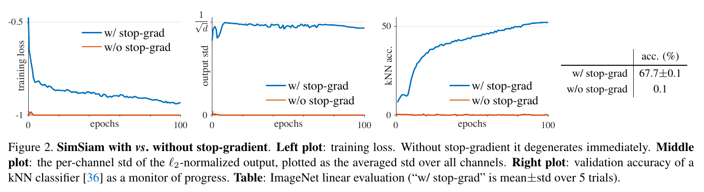

---
tags:
   - CVPR
   - Representation Learning
---
# Exploring Simple Siamese Representation Learning (SimSiam)

- Paper: https://arxiv.org/abs/2011.10566
- Code: https://github.com/facebookresearch/simsiam

## Background

### Siamese networks

Applications:

- signature [4]
- face verification [34]
- tracking [3]
- one-shot learning [23]

## Problem

Siamese networks 會產生 trivial solutions：所有的輸出結果都是常數，且準確率非常低，如下圖。

有幾種策略來避免這個問題：

- **Contrastive learning**: 例如 **SimCLR** [8] 使用正負樣本進行 contrastive learning，負樣本可以用來避免產生常數的解。
- **Clustering**: 例如 **SwAV** [7] 套用 online clustering 到 Siamese networks 。
- **BYOL** [15] 使用 momentum encoder.

## Method

1. stop-grad
2. predictor

輸入影像經由資料擴增成為兩個 views $x_1, x_2$ 後，個別傳入一個共享參數的 encoder $f$，到目前為止和一般的 Siamese Networks 並無不同。接著，其中一個 view 傳入一個 MLP head [15] 組成的 predictor $h$，輸出結果為 $p_1 \triangleq h(f(x_1))$，並且和另一個 view $z_2 \triangleq f(x_2)$ 計算 negative cosine similarity:

$$
\mathcal{D}\left(p_{1}, z_{2}\right)=-\frac{p_{1}}{\left\|p_{1}\right\|_{2}} \cdot \frac{z_{2}}{\left\|z_{2}\right\|_{2}}
$$

接著，根據 [15] 這裡定義一個對稱化的 loss:

$$
\mathcal{L}=\frac{1}{2} \mathcal{D}\left(p_{1}, z_{2}\right)+\frac{1}{2} \mathcal{D}\left(p_{2}, z_{1}\right)
$$

對每一張影像都計算這個 loss，其 total loss 為所有影像的 loss 再取平均，最小值為 $-1$。最後，套用這篇方法的重點：在訓練過程，**在 $z$ 的部份停止傳遞梯度 (stop-gradient, `stopgrad`)**。上式修改如下：

$$
\mathcal{L}=\frac{1}{2} \mathcal{D}\left(p_{1}, \text { stopgrad }\left(z_{2}\right)\right)+\frac{1}{2} \mathcal{D}\left(p_{2}, \text { stopgrad }\left(z_{1}\right)\right)
$$

演算法如下：

### Baseline settings

#### Optimizer

- 標準 SGD
- batch size: $512$
- learning rate: 使用 linear scaling [15] 的機制 ($lr \times \text{BatchSize} / 256$)，初始值設定為 $0.05$
- 使用 cosine decay schedule
- weight decay: $0.0001$
- momentum: $0.9$

#### Projection MLP (encoder $f$)

3 層 MLP:

- (BN+fc+ReLU)*2+(BN+fc)
- hidden layer: $2048$-d

#### Prediction MLP (predictor $h$)

2 層 MLP:

- (BN+fc+ReLU)*2+(BN+fc)

## Empirical Study

以下是實驗結果：

### Stop-gradient

Figure 2. 的實驗展示了 collapse 存在的問題。

1. 一般的 Siamese Network 的 training loss 在很早期的時候就會下降到最低值（在這實驗中是 $-1$）；而加入 stop-grad 機制後則會有正常的 loss 曲線。
2. 觀測輸出結果經由 $l_2$ 標準化 ($z/\|z\|_2$) 後的標準差。因為一般的 Siamese Network 輸出為定值，所以標準差為 $0$；而加入 stop-grad 機制後，其標準差落在合理的 $\frac{1}{\sqrt{d}}$。
   註：如果 $z$ 為一個 zero-mean isotropic Gaussian distribution，其 $z/\|z\|_2$ 的標準差近似於 $\frac{1}{\sqrt{d}}$。
3. 如同 1. 的結果，Siamese Network 的準確率趨近於 $0\%$；而加入 stop-grad 機制後，會正常的在訓練過程中往上提升。
4. 最後經過五次實驗之後的平均準確率。

### Predictor

如果不加 predictor MLP 會如何？從 symmetric loss 來看：

$$
\mathcal{L}=\frac{1}{2} \mathcal{D}\left(p_{1}, \text { stopgrad }\left(z_{2}\right)\right)+\frac{1}{2} \mathcal{D}\left(p_{2}, \text { stopgrad }\left(z_{1}\right)\right)
$$

不使用 predictor 的話，上式會變成：

$$
\mathcal{L}=\frac{1}{2} \mathcal{D}\left(z_{1}, \text { stopgrad }\left(z_{2}\right)\right)+\frac{1}{2} \mathcal{D}\left(z_{2}, \text { stopgrad }\left(z_{1}\right)\right)
$$

它的 gradient 會和 $\mathcal{D}(z_1,z_2)$ 相同，大小為一半。這種情況下，幾乎等同於沒有加入 stop-grad 機制，所以會發生 collapse。

Table 1. 的實驗展示了 predictor MLP 的影響：

1. (a) 當沒有 predictor MLP $h$ 時，collapse 會發生。
2. (b) 如果 $h$ 的參數經過隨機初始化後設定為定值，這樣也不行。但原因並非發生 collapse，而是訓練不收斂，loss 維持在高的值。因此，$h$ 的參數需要進行訓練。
3. (c) 另外作者也發現如果用固定的 learning rate，訓練結果會更好。可能的解釋為 $h$ 需要適應最新的 representations，所以減少 learning rate 並非必要。在很多的模型變體中，也發現固定的 learning rate 結果會稍微的更好。

### Batch Size

實驗設定：固定 SGD 演算法，learning rate 使用 linear scaling rule ($lr \times \text{BatchSize}/256$)。在 batch size $\ge 1024$ 使用 $10$ epochs of warm-up [14]。

從 Table 2. 結果發現：SimSiam 的 batch size 設定值是很寬容的，不管設定多少都可以有相似的結果。對比之下，SimCLR 和 SwAV 必須要有非常大的 batch size (e.g., $4096$) 才可以用。

作者注意到標準的 SGD 在 batch size 太大時無法運作，即使是監督式訓練也不行；而這個實驗結果說明了不需要特化的 optimizer。

### Batch Normalization

從 Table 3. 結果發現：

1. (a) 將所有的 BN 移除之後，準確率下降到 $34.6 \%$，但沒有發生 collapse。推測原因是最佳化的難度太高。
2. (b) 在 hidden layers 加入 BN 以後就提升到 $67.4 \%$。

### Similarity Function

把相似度函數修改如下：

$$
\mathcal{D}\left(p_{1}, z_{2}\right)=-\operatorname{softmax}\left(z_{2}\right) \cdot \log \operatorname{softmax}\left(p_{1}\right)
$$

結果為：

結果較差一些，但沒有發生 collapse，證明和相似度函數無關。

### Symmetrization

Symmetrized loss:

$$
\mathcal{L}=\frac{1}{2} \mathcal{D}\left(p_{1}, \text {stopgrad}\left(z_{2}\right)\right)+\frac{1}{2} \mathcal{D}\left(p_{2}, \text {stopgrad}\left(z_{1}\right)\right)
$$

Asymmetrized loss:

$$
\mathcal{D}\left(p_{1}, \text { stopgrad }\left(z_{2}\right)\right)
$$

$2 \times$ asym. 代表對每個影像都採樣兩次。結果如下：

代表 Symmetrization 對結果影響不多，類似於更密集的採樣。

## Hypothesis

以 proof-of-concept 實驗來分析 SimSiam 究竟做了什麼導致它能成功。

### Formulation

Hypothesis: 假設 SimSiam 以 Expectation-Maximization (EM) like 演算法實作，涉及兩組變數和兩組子問題 (sub-problems)。

考慮一個 loss function 如下形式：

$$
\mathcal{L}(\theta, \eta)=\mathbb{E}_{x, \mathcal{T}}\left[\left\|\mathcal{F}_{\theta}(\mathcal{T}(x))-\eta_{x}\right\|_{2}^{2}\right]
$$

- $\mathcal{F}$: 神經網路模型，$\theta$ 是它的參數。
- $\mathcal{T}$: 資料擴增的變換函數
- $x$: 輸入影像
- $\eta_x$: 輸入影像的特徵，其大小正比於輸入影像的數量。

這個 loss 是一個影像與擴增的分佈期望值。為了簡化分析，以 mean square error (MSE) 代替 cosine similarity，因為向量經過 $l_2$-normalized 計算會等同於 MSE。

考慮到求解這個 loss function:

$$
\min _{\theta, \eta} \mathcal{L}(\theta, \eta)
$$

這個式子類似於 k-means clustering：$\theta$ 類似於群中心，$\eta_x$ 類似於 $x$ 的 assignment vector (一種 one-hot vector)。也類似於 k-means，這個式子以一種交替的迭代演算法進行最佳化：固定某一組變數，求解另一組。如下：

$$
\begin{aligned}
\theta^{t} & \leftarrow \arg \min _{\theta} \mathcal{L}\left(\theta, \eta^{t-1}\right) \newline
\eta^{t} & \leftarrow \arg \min _{\eta} \mathcal{L}\left(\theta^{t}, \eta\right)
\end{aligned}
$$

#### Solving $\theta$

可以使用 SGD 進行求解，而這正好是 stop-grad 機制：gradient 不會在 $\eta^{t-1}$ 進行 back propagate。

#### Solving $\eta$

可以直接透過下式計算來求解：

$$
\eta_{x}^{t} \leftarrow \mathbb{E}_{\mathcal{T}}\left[\mathcal{F}_{\theta^{t}}(\mathcal{T}(x))\right]
$$

#### One-step alternation

本來要計算期望值需要採樣所有 augmentation，可以只採樣一次來近似，標記為 $\mathcal{T}^\prime$:

$$
\eta_{x}^{t} \leftarrow \mathcal{F}_{\theta^{t}}\left(\mathcal{T}^{\prime}(x)\right)
$$

帶回去原式，將被改為如下：

$$
\theta^{t+1} \leftarrow \arg \min _{\theta} \mathbb{E}_{x, \mathcal{T}}\left[\left\|\mathcal{F}_{\theta}(\mathcal{T}(x))-\mathcal{F}_{\theta^{t}}\left(\mathcal{T}^{\prime}(x)\right)\right\|_{2}^{2}\right]
$$

其中，$\theta^t$ 是常數。因此，上面的式子代表：Siamese network + stop-grad。

#### Predictor

現在開始探討 predictor $h$ 在這個架構中的作用。

根據定義，predictor $h$ 預期用來最小化下式：

$$
\mathbb{E}_{z}\left[ \left \| h \lbrace z_{1} \rbrace - z_{2} \right \|_{2}^{2}\right]
$$

最佳解為

$$
h\left(z_{1}\right)=\mathbb{E}_{z}\left[z_{2}\right]=\mathbb{E}_{\mathcal{T}}[f(\mathcal{T}(x))] \quad \text{for any image } x
$$

在前面的式子中，利用 one-step alternation 近似期望值得解。在實務上，不可能透過採樣所有資料點來算出期望值，因此在這邊透過一個神經網路 predictor $h$ 來預測它的期望值。

#### Symmetrization

到目前為止，都還沒有涉及到 symmetrization。symmetrization 在此處的作用像是更密集的採樣 $\mathcal{T}$。實際上這並非是必要的，不過它可以提昇準確率。

### Proof of concept

#### Multi-step alternation

以下的實驗使用與 SimSiam 相同的架構和 hyperparameter，計算下面的最佳化：

$$
\begin{aligned}
\theta^{t} & \leftarrow \arg \min _{\theta} \mathcal{L}\left(\theta, \eta^{t-1}\right) \newline
\eta^{t} & \leftarrow \arg \min _{\eta} \mathcal{L}\left(\theta^{t}, \eta\right)
\end{aligned}
$$

兩個最佳化式子代表會分為兩個 loop 進行更新參數: inner loop ($\theta$) 與 outer loop ($\eta$)。其中，要用 $k$ 個 SGD steps 來更新 $\theta$，結果如下：

從上式可以看出，one-step alteration 的想法是可行的，更多的 steps 雖然結果更好，但是計算量更大。

#### Expectation over augmentations

以下的實驗為了驗證 predictor $h$ 是否可以近似期望值的計算結果。在這裡，使用 moving-average (類似於 [36] 的 memory bank) 來更新 $\eta$:

$$
\eta_{x}^{t} \leftarrow m * \eta_{x}^{t-1}+(1-m) * \mathcal{F}_{\theta^{t}}\left(\mathcal{T}^{\prime}(x)\right)
$$

最後的結果達到 $55.0 \%$ 的準確率。如果完全移除 $h$ 的話，結果如 Table 1a。因此，這個實驗代表 predictor $h$ 可以用來近似 $\mathbb{E}_{\mathcal{T}}[\cdot]$。

### Discussion

以上的 hypothesis 試圖解釋 SimSiam 可能是什麼，還沒有以形式化的方式來確定為何可以解決 collapse 的問題。因此，到這篇還是以經驗來推斷它可以解決 collapse。

作者提供一個觀點來解釋為何解決了 collapse 問題：alternating optimization 提供了另一種 trajectory，$\eta_x$ 在這個最佳化過程中沒有對所有 $x$ 計算梯度，因此很難對所有 $x$ 都產生一個固定值。

## Comparisons

### Result Comparisons

#### ImageNet

結果如下：

"+" 代表重製過，產生更好的結果（詳見附錄）。

SimSiam 使用更少的 batch size，沒有負樣本也沒有 momentum encoder，且所有結果都比 SimCLR 更好。

#### Transfer Learning

在 ImageNet 進行 pre-training，之後用到 object detection 和 instance segmentation。

### Methodology Comparisons

#### Relation to SimCLR

和 SimCLR 相比：

- SimSiam 沒有使用負樣本
- SimCLR 沒有 stop-grad 與 predictor

因此，下面實驗以 SimCLR 為基準，加入 predictor 和 stop-grad 進行 ablation study：

結果都對 SimCLR 沒有幫助。作者認為，可能 stop-grad 和 predictor 是另一個最佳化問題的因素，和 contrastive learning 不同。因此，這些對 contrastive learning 沒有幫助。

#### Relation to SwAV

SimSiam 類似於 "SwAV without online clustering"。SwAV 中的 Sinkhorn-Knopp (SK) transform 也套用了 stop-grad 機制。

下面實驗以 SwAV 為基準，加入 predictor 和移除 stop-grad 進行 ablation study：

SwAV 是一個 clustering 方法，因此不能移除 stop-grad。

#### Relation to BYOL

SimSiam 類似於 "BYOL without the momentum encoder"

如同 SimSiam 的 stop-grad 機制，BYOL 的 momentum encoder 也可以產生一個更平滑的 $\eta$。可能存在其他的 optimizer 可以求解 $\eta$。

## Summary

SimSiam: Siamese networks with simple design

- predictor $h$
- stop-gradient
- symmetrized loss
